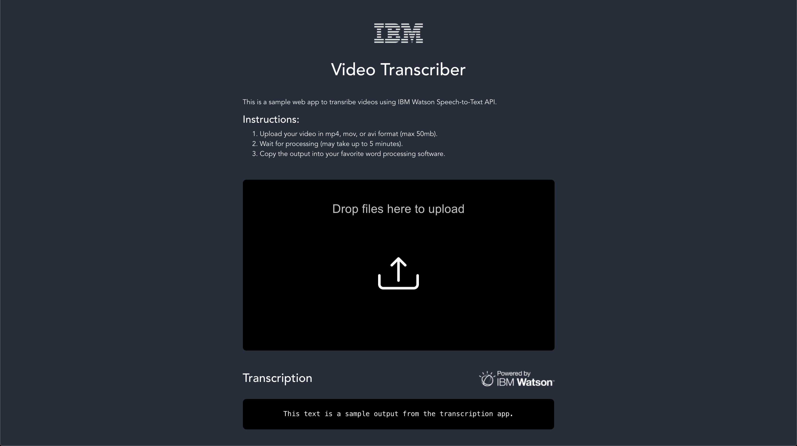

# Video Transcriber Frontend



## Prerequisites

1. Install [`Node.js`](https://nodejs.org)
1. Install [`Yarn`](https://classic.yarnpkg.com/en/docs/install/#mac-stable)
1. Clone this repository
   ```
   $ git clone https://github.ibm.com/Pedro-Cruz/video-transcriber
1. Change to `video-transcriber` directory
   ```
   $ cd video-transcriber

## Project setup
```
yarn install
```

### Compiles and hot-reloads for development
```
yarn serve
```

### Compiles and minifies for production
```
yarn build
```

### Lints and fixes files
```
yarn lint
```
